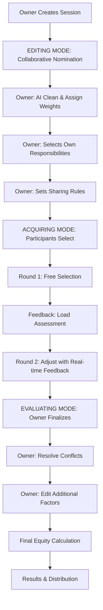

# Equity Distribution Tool - Technical Specification

> **Living Document** | Version 1.1 | Last Updated: February 10, 2026  
> This specification is designed to evolve. See [Version Control](#version-control) for update procedures.

---

## 1. Overview

### 1.1 Purpose
A collaborative tool that analyzes business concepts and distributes equity among co-founders/team members based on their operational responsibilities and additional factors. The tool uses a structured three-mode workflow with role-based permissions, ensuring fair, transparent, and AI-assisted equity distribution.

### 1.2 Core Principles
- **Comprehensive & Non-overlapping**: AI generates smart, exhaustive responsibility lists without duplication
- **Owner-Orchestrated**: One owner controls the process flow and has full visibility
- **Blind Selection**: Participants select independently without seeing others' choices
- **AI-Assisted**: Intelligent cleaning, rebalancing, and assignment recommendations
- **Transparent Calculation**: Clear formulas and breakdowns for all equity decisions

### 1.3 Core Workflow



**Detailed Flow:**
1. **Session Setup**: Owner creates session, inputs business concept
2. **EDITING MODE**: All participants nominate responsibilities (collaborative)
3. **Owner Processing**: AI cleans list, owner assigns weights, owner selects first
4. **ACQUIRING MODE**: Owner sends to participants for selection (two rounds)
5. **EVALUATING MODE**: Owner resolves conflicts, edits factors, finalizes equity
6. **Results**: Generate reports, checklists, and distribution documents

---

## 2. Roles & Permissions

### 2.1 Role Definitions

#### 2.1.1 Owner (Session Creator)
The owner has permanent, exclusive control over:
- Session creation and configuration
- Mode transitions (Editing → Acquiring → Evaluating)
- AI agent functions (cleaning, rebalancing)
- Weight assignment and visibility
- Responsibility sharing settings (open/closed)
- Conflict resolution and final assignments
- Additional factor editing for all participants
- Session management (locking, removing participants)
- Exporting results

**Visibility**: Sees all nominations, selections, and data in real-time

#### 2.1.2 Participants
Participants can:
- Nominate responsibilities during Editing mode
- Select responsibilities during Acquiring mode (two rounds)
- View their own selections and feedback
- See final assigned responsibilities and equity (after Evaluating)

**Restrictions**:
- Cannot see weights or importance levels
- Cannot see other participants' selections
- Cannot transition modes
- Cannot edit after submission (unless in Round 2 of Acquiring)

### 2.2 Session Setup

#### 2.2.1 Initial Configuration
**Owner creates session with:**
- Session name/ID
- Business concept description (free-form text, min 100 characters)
- Number of participants (1-20, not including owner)
- Session type: Synchronous / Asynchronous / Hybrid

#### 2.2.2 Participant Management
- Each participant gets a **unique access link**
- One user per link (enforced)
- Owner can:
  - Generate new links
  - Remove participants (invalidates their link)
  - Lock session (prevents new participants from joining)
  - Unlock session (allows new participants)

#### 2.2.3 Session States
```
SETUP → EDITING → PROCESSING → ACQUIRING → EVALUATING → COMPLETED
```

**State Transitions**: Controlled exclusively by owner

---

## 3. MODE 1: Editing Mode (Collaborative Nomination)

### 3.1 Purpose
All participants (including owner) collectively nominate responsibilities that should exist in the business. This is a brainstorming phase focused on comprehensiveness.

### 3.2 AI-Powered Initial Generation

#### 3.2.1 Business Concept Analysis
Owner inputs business description. AI analyzes and identifies:

**Business Profile:**
- **Type**: (e.g., SaaS, E-commerce, Marketplace, Consulting, Agency, Hardware, etc.)
- **Industry**: (e.g., FinTech, HealthTech, EdTech, Consumer Goods, B2B Services, etc.)
- **Stage**: (e.g., Ideation, Pre-launch, MVP, Early-stage, Growth, Scaling)
- **Business Model**: (e.g., B2B, B2C, B2B2C, Subscription, Freemium, Marketplace, etc.)
- **Target Market**: (e.g., SMBs, Enterprise, Consumers, Vertical-specific)
- **Key Activities**: (e.g., Software development, Content creation, Manufacturing, etc.)

Display this analysis clearly at the top of the session.

#### 3.2.2 Comprehensive Responsibility Generation

**AI must generate 25-50 responsibilities** that are:
- ✅ **Comprehensive**: Cover all necessary business functions
- ✅ **Non-overlapping**: Each responsibility is distinct
- ✅ **Specific**: Clear what each entails
- ✅ **Actionable**: Can be assigned to real people
- ✅ **Stage-appropriate**: Relevant to current business stage

**Responsibility Categories** (adjust based on business type):

**Strategic & Leadership**
- Vision & Strategy Development
- Business Model Refinement
- Strategic Planning & Execution
- Decision Making & Governance
- Board Management & Reporting
- Investor Relations & Fundraising
- Strategic Partnership Development
- Competitive Intelligence & Analysis

**Product & Technology** (if applicable)
- Product Strategy & Roadmap
- Product Design & User Experience
- Frontend Development
- Backend Development
- Mobile Development
- Infrastructure & DevOps
- Quality Assurance & Testing
- Technical Architecture
- Data Engineering & Analytics
- Security & Compliance
- API Development & Integration
- Technical Documentation

**Sales & Business Development**
- Sales Strategy & Planning
- Lead Generation
- Sales Pipeline Management
- Client Acquisition
- Account Management
- Contract Negotiation
- Business Development
- Channel Partnership Development

**Marketing & Brand**
- Marketing Strategy
- Brand Development & Positioning
- Content Marketing & Strategy
- Digital Marketing (SEO, SEM, Social)
- Email Marketing & Automation
- Community Building & Management
- Public Relations
- Event Planning & Execution
- Marketing Analytics

**Operations & Finance**
- Operations Strategy & Management
- Process Design & Optimization
- Supply Chain Management (if applicable)
- Vendor Management
- Financial Planning & Analysis
- Accounting & Bookkeeping
- Budget Management
- Legal & Compliance
- Contract Management
- Risk Management

**People & Culture**
- HR Strategy
- Recruiting & Hiring
- Onboarding & Training
- Performance Management
- Culture Development
- Compensation & Benefits
- Employee Relations

**Customer Success & Support**
- Customer Success Strategy
- Customer Support & Service
- Onboarding & Implementation
- Training & Education
- Customer Feedback & Research
- Community Management
- Retention & Upselling

**Administrative**
- Office Management
- Administrative Operations
- Travel & Logistics
- Vendor Coordination
- Documentation & Knowledge Management

#### 3.2.3 Responsibility Detail Structure
Each AI-generated responsibility includes:

```json
{
  "id": "resp_001",
  "category": "Product & Technology",
  "title": "Product Strategy & Roadmap",
  "description": "Define product vision, prioritize features, create and maintain product roadmap, coordinate with stakeholders on product direction",
  "typical_time_commitment": "20-30% of full-time",
  "criticality": "Critical",
  "stage_relevance": ["Pre-launch", "MVP", "Early-stage", "Growth"],
  "suggested_weight": 0.0,  // Not assigned yet
  "sharing_allowed": null,  // Not set yet
  "nominated_by": ["ai"],
  "status": "pending"
}
```

### 3.3 Participant Nomination Process

#### 3.3.1 Nomination Interface
All participants (including owner) see:
- AI-generated responsibility list (organized by category)
- Button: "Nominate New Responsibility"
- Their own nominated responsibilities highlighted

**Nomination Form Fields:**
- Category (dropdown or custom)
- Title (required, max 100 chars)
- Description (required, min 50 chars)
- Estimated time commitment (optional)

#### 3.3.2 Submission & Collation
- Each participant can nominate multiple responsibilities
- Nominations are **NOT visible to other participants** in real-time
- When participant clicks "Submit Nominations," their list is sent to owner
- Owner sees a collated master list showing who nominated what

#### 3.3.3 Owner View During Editing
Owner sees:
```
Original AI List (25 items)
+ Participant A Nominations (3 items)
+ Participant B Nominations (5 items)
+ Owner Nominations (2 items)
= Master List (35 items) - may contain duplicates
```

### 3.4 AI Agent Function: Cleaning & Optimization

When owner clicks "AI Clean," the AI agent:

#### 3.4.1 Duplicate Detection
- Identifies responsibilities that are identical or near-identical
- **Action**: Flags for merging with suggested combined title/description

#### 3.4.2 Overlap Detection
- Identifies responsibilities with significant overlap (>60% similarity)
- **Action**: Suggests merging or splitting into distinct sub-responsibilities

#### 3.4.3 Reorganization
- Reviews category assignments
- **Action**: Suggests better categorization or new categories

#### 3.4.4 Relevance Check
- Identifies responsibilities that seem irrelevant to the business type
- **Action**: Flags with explanation and asks owner for confirmation before removal

#### 3.4.5 Gap Analysis
- Identifies missing critical responsibilities based on business type
- **Action**: Suggests additions

#### 3.4.6 Clarity Enhancement
- Identifies vague or unclear descriptions
- **Action**: Suggests improved wording

**AI Cleaning Output:**
```
✅ Merged 3 duplicates → 1 responsibility
⚠️ Flagged 2 for relevance review:
   - "Social media influencer management" - seems out of scope for B2B SaaS
🔄 Suggested recategorization: 4 items
➕ Suggested additions: 2 critical responsibilities missing
📝 Improved clarity: 5 descriptions rewritten

Current: 35 items → Cleaned: 28 items
```

Owner can:
- Accept all suggestions
- Review and accept individually
- Reject suggestions
- Manually edit any responsibility

### 3.5 Transition to Next Phase

**Requirements before owner can proceed:**
- At least 15 responsibilities in final list
- Each responsibility has a category
- Each responsibility has a description (min 50 chars)
- No two responsibilities have identical titles

**Owner Action**: Click "Finalize Responsibility List" → Proceeds to Weight Assignment

---

## 4. Owner Processing: Weight Assignment & Personal Selection

### 4.1 AI-Powered Auto-Weighting

#### 4.1.1 Weight Assignment Logic
AI assigns weights (0.1% to 15%) based on:

**1. Criticality to Business Success (40%)**
- How essential is this for the business to function?
- What happens if this isn't done?
- Critical: Company fails or stalls (10-15% range)
- High: Significant impact on growth (6-10% range)
- Medium: Important but not make-or-break (3-6% range)
- Low: Nice to have, can be delayed (0.1-3% range)

**2. Time & Effort Required (30%)**
- How many hours per week/month?
- Full-time equivalent: High weight
- Part-time: Medium weight
- Occasional: Low weight

**3. Skill Scarcity & Difficulty (20%)**
- How hard is it to do well?
- How rare is the skill?
- High expertise needed: Higher weight
- Learnable skills: Medium weight
- Common skills: Lower weight

**4. Business Stage Relevance (10%)**
- How critical is this at current stage?
- Pre-launch: Product, fundraising (higher weight)
- Growth: Sales, marketing, ops (higher weight)
- Scaling: Operations, systems, people (higher weight)

#### 4.1.2 Business-Type Specific Weighting

**SaaS / Tech Products:**
- Product Strategy & Development: 10-15%
- Engineering/Development: 8-12%
- Sales & BD: 6-10%
- Marketing: 4-8%

**E-commerce:**
- Operations & Supply Chain: 10-15%
- Marketing & Growth: 10-15%
- Product Sourcing: 6-10%
- Technology: 4-8%

**Marketplace:**
- Business Development (both sides): 12-15%
- Community & Operations: 8-12%
- Product & Tech: 6-10%

**Consulting / Services:**
- Client Acquisition & Sales: 12-15%
- Service Delivery: 10-15%
- Operations: 5-8%

#### 4.1.3 Weight Distribution Rules
- **Total must equal 100.0%** (±0.01% tolerance)
- **No single responsibility >15%** (prevents over-concentration)
- **Critical responsibilities: 8-15%**
- **High-priority: 5-10%**
- **Medium-priority: 3-7%**
- **Standard: 1-5%**
- **Minor: 0.1-2%**

#### 4.1.4 Weight Assignment Display

Owner sees table:
| Category | Responsibility | Criticality | Time | Weight | Actions |
|----------|---------------|-------------|------|--------|---------|
| Strategic | Vision & Strategy | Critical | 20% FTE | 12.5% | Edit/Lock |
| Product | Product Roadmap | Critical | 30% FTE | 10.0% | Edit/Lock |
| Engineering | Backend Development | High | 40% FTE | 8.5% | Edit/Lock |
| ... | ... | ... | ... | ... | ... |

**Total: 100.0%**

### 4.2 Manual Weight Editing

#### 4.2.1 Edit Controls
Owner can:
- Click any weight to edit directly
- Use slider for visual adjustment
- "Lock" weights to prevent auto-rebalancing
- "Unlock" to allow rebalancing

#### 4.2.2 Auto-Rebalancing
When owner changes a weight:
- If other weights are unlocked → Auto-rebalance proportionally
- If all others are locked → Show error: "Cannot exceed 100%"
- Show live preview of rebalancing before confirming

**Example:**
```
Before:
A: 10% (unlocked)
B: 15% (locked)
C: 25% (unlocked)
D: 50% (unlocked)
Total: 100%

Owner changes A to 20%:
New A: 20% (+10%)
B: 15% (locked, no change)
Remaining 85% redistributed proportionally:
C: 25/75 × 65 = 21.67%
D: 50/75 × 65 = 43.33%
Total: 100%
```

#### 4.2.3 AI Rebalancing Assistant
Owner can click "AI Rebalance" at any time:
- AI reviews current weights
- Suggests adjustments based on latest weight assignment logic
- Shows before/after comparison
- Owner accepts or rejects

### 4.3 Owner Selects Own Responsibilities

**Before sending to participants, owner must select their responsibilities first.**

#### 4.3.1 Selection Interface
Owner sees same list but can:
- Check boxes for responsibilities they'll handle
- See running total of weight (not percentage yet)
- Get color-coded feedback on load

#### 4.3.2 Load Assessment (Same as Participants will get later)
```
Green (Ideal): 15-40% of total weight
Yellow (Heavy): 40-65%
Orange (Very Heavy): 65-85%
Red (Unsustainable): >85%
```

#### 4.3.3 Post-Selection
After owner selects, those responsibilities are:
- **Internally marked** (not visible to participants) 
- Can still be shared if owner sets them as "Open for sharing"
- Owner proceeds to set sharing rules

For unselected responsibilities:
- Default status: "Pending Approval"
- Owner will decide assignment during Evaluating mode

### 4.4 Setting Sharing Rules

#### 4.4.1 Sharing Status Assignment
Owner reviews each responsibility and sets:

**For Owner's selected responsibilities:**
- ☑️ Open for sharing (others can also select)
- ☐ Closed (owner exclusive)

**For unselected responsibilities:**
- ☑️ Open for sharing (multiple people can select)
- ☐ Closed (only one person can select - first come, first served, pending approval)

#### 4.4.2 Selection Limits
Owner sets instruction parameters:
- **Minimum responsibilities**: (e.g., "Select at least 3")
- **Maximum responsibilities**: (e.g., "Select no more than 12")
- **Target load range**: (e.g., "Aim for 20-40% total weight")

These appear as instructions to participants but are not enforced (only guidance).

### 4.5 Transition to Acquiring Mode

**Owner Action**: Click "Send to Participants" → Generates and sends unique links

---

## 5. MODE 2: Acquiring Mode (Participant Selection)

### 5.1 Mode Overview

**Two-Round Process:**
1. **Round 1**: Participants freely select responsibilities, submit, receive feedback
2. **Round 2**: Participants can adjust selections with real-time feedback

**Key Constraints:**
- Participants are **blind** to other participants' selections
- Weights are **hidden** from participants
- Only workload indicator visible: Light / Medium / Heavy / Unsustainable
- Owner sees all selections in real-time

### 5.2 Round 1: Free Selection

#### 5.2.1 Participant View
#### 5.2.1 Participant View
Participant sees:
- **Session Info**: Business name, their role
- **Instructions**: Owner's guidance on min/max selections and target load
- **Responsibility List**: Organized by category

**For each responsibility:**
```
[Checkbox] Product Strategy & Roadmap
Category: Product & Technology
Description: Define product vision, prioritize features...
Workload: ◉ Heavy
Time Commitment: ~20-30% FTE
Status: Available / Pending Approval / Open for sharing
```

**Visual Indicators:**
- ✓ Open for sharing (green badge)
- ⏳ Pending Approval (orange badge) 
- ✗ Already assigned (if closed, shows "Not available")
- ◉ Workload level shown as: ◉ Unsustainable | ◐ Heavy | ◯ Medium | ○ Light

**NO weight values or percentages shown**

#### 5.2.2 Selection Process
1. Participant checks boxes for desired responsibilities
2. Can select any "open" responsibility
3. Can select "closed" responsibilities (flagged as pending approval)
4. No running total yet (just checkboxes)
5. Click "Submit Round 1"

#### 5.2.3 Round 1 Feedback

After submission, participant sees:

**Your Selected Responsibilities:**
[List of checked items with categories]

**Load Assessment:**
```
Your selected workload: [COLOR BAR]
🟢 Ideal Load (20-40%)
🟡 Heavy Load (40-65%)  
🟠 Very Heavy (65-85%)
🔴 Unsustainable (>85%)

Current Status: 🟡 Heavy Load
```

**Feedback Message (AI-generated based on load):**
```
🟢 Green: "Your selection looks balanced for a co-founder role. You can proceed or adjust if needed."

🟡 Yellow: "Your workload is on the heavier side. Consider if you can realistically handle these responsibilities or if some could be shared or delegated."

🟠 Orange: "This is a very heavy workload. Review your selections carefully - you may be taking on too much to execute effectively."

🔴 Red: "This workload is likely unsustainable. Strongly consider reducing your responsibilities to ensure quality execution."
```

**Action Options:**
- "I'm confident - Submit Final" (proceeds to wait for others)
- "Let me adjust" (proceeds to Round 2)

### 5.3 Round 2: Adjustment with Real-Time Feedback

#### 5.3.1 Enhanced Interface
If participant chooses to adjust, they see:

**Same responsibility list with their Round 1 selections already checked, BUT with real-time features:**
- **Running Total Bar**: Visual bar showing current load with color coding
- **Live Percentage**: "Current Load: 52% 🟡"
- **Immediate Feedback**: As they check/uncheck, the bar updates instantly
- **Suggested Range**: Visual marker showing ideal range (20-40%)

#### 5.3.2 Selection Dynamics
- Check a box → Bar extends, number increases
- Uncheck a box → Bar shrinks, number decreases
- Color changes dynamically based on current total
- Can add or remove any responsibilities from Round 1

#### 5.3.3 Round 2 Submission
- Changes are live-saved as they make them
- Participant clicks **"Finalize My Selection"**
- **After finalization: NO MORE EDITING ALLOWED**
- Participant enters waiting state for owner to proceed
- Status changes to "Finalized - Awaiting Evaluation"

### 5.4 Owner's Real-Time View

#### 5.4.1 Live Dashboard
Owner sees master view with all participants:

```
ACQUIRING MODE - LIVE STATUS

Participant A (Round 2 - Adjusting) 🟢 38%
Participant B (Round 1 - Submitted) 🟡 62%
Participant C (Not Started) ⚪ 0%
Participant D (Finalized) 🟢 35%

Total Coverage: 165% (some overlap expected)
```

#### 5.4.2 Detailed Selection Matrix
Owner sees who selected what:

| Responsibility | Owner | Part. A | Part. B | Part. C | Sharing | Status |
|---------------|-------|---------|---------|---------|---------|--------|
| Product Strategy | ✓ | ✓ | - | - | Open | Shared |
| Backend Dev | - | ✓ | ✓ | - | Closed | ⚠️ Conflict |
| Marketing | ✓ | - | ✓ | ✓ | Open | Shared |

**Color Coding:**
- ✅ Green: Assigned, no conflict
- 🟡 Yellow: Shared (open for sharing)
- 🔴 Red: Conflict (closed but multiple selections)
- ⚪ Gray: Unassigned

#### 5.4.3 Real-Time Conflict Alerts
Owner gets alerts:
```
⚠️ Conflict: "Backend Development" selected by A and B (marked closed)
⚠️ Gap: "HR & Recruiting" not selected by anyone
```

### 5.5 Transition to Evaluating Mode

**Owner can proceed when:**
- All participants have finalized their selections
- OR owner decides to proceed without certain participants

**If participants haven't finalized:**
- Owner sees warning: "3 participants have not finalized their selections"
- Owner can:
  - Wait for them to complete
  - Send reminder notifications
  - **Remove participant** (removes them from session, their data archived)
  - Proceed anyway (their last saved selections will be used)

**Owner Action**: Click "Proceed to Evaluation"

**Effect:**
- Acquiring mode closed (no more changes allowed)
- Participants see: "Your selections have been submitted. Owner is now finalizing assignments."
- Owner enters Evaluating mode

---

## 6. MODE 3: Evaluating Mode (Owner-Only Finalization)

### 6.1 Mode Purpose
Owner makes final decisions on:
1. Resolving conflicts (closed responsibilities with multiple selections)
2. Approving shared responsibilities
3. Filling gaps (unassigned responsibilities)
4. Editing additional factors for all participants
5. Running final equity calculations

### 6.2 Conflict Resolution

#### 6.2.1 Conflict List
Owner sees all responsibilities with conflicts:

```
🔴 CONFLICTS TO RESOLVE (3)

1. Backend Development (Closed)
   Selected by: Participant A, Participant B
   Weight: 8.5%
   
   [AI Suggestion 💡]
   Recommended: Participant A
   Reason: Has 5 years backend experience (from profile), lighter overall load (35% vs 62%)
   
   Assign to:
   ○ Participant A
   ○ Participant B
   ○ Split responsibility (make Open)
   ○ Keep unassigned
   
2. Fundraising & Investor Relations (Closed)
   Selected by: Owner, Participant C
   Weight: 10%
   ...
```

#### 6.2.2 AI Assignment Suggestions
For each conflict, AI provides recommendation based on:
- Overall workload balance
- Relevant experience (if available)
- Other responsibilities selected (synergy)
- Criticality of responsibility

Owner can:
- Accept AI suggestion (one click)
- Manually select assignee
- Convert to "Open for sharing" and split
- Leave unassigned (with warning)

### 6.3 Shared Responsibility Confirmation

#### 6.3.1 Shared List
Owner sees all "Open" responsibilities with multiple selections:

```
🟡 SHARED RESPONSIBILITIES (5)

1. Marketing Strategy
   Selected by: Owner, Participant B
   Weight: 7%
   Split: 3.5% each
   
   ✓ Approve sharing
   ☐ Assign to one person instead
   
2. Customer Support
   Selected by: Participant A, Participant D
   Weight: 4%
   Split: 2% each
   ...
```

Owner can:
- Approve all (batch action)
- Approve individually
- Convert to exclusive assignment

### 6.4 Gap Management

#### 6.4.1 Unassigned Responsibilities
Owner sees critical responsibilities not selected:

```
⚠️ UNASSIGNED RESPONSIBILITIES (3)

🔴 Critical:
- Legal & Compliance (5%) - No one selected

🟠 High:
- HR & Recruiting (4%) - No one selected

🟡 Medium:
- Office Administration (2%) - No one selected

Owner Actions:
[ ] Assign to myself (add to my responsibilities)
[ ] Assign to specific participant: [Dropdown]
[ ] Mark as "External/Hire Later"
[ ] Mark as "Not needed for now"
[ ] Send to all participants for selection
```

#### 6.4.2 Sending Unassigned Responsibilities to Participants

If owner chooses "Send to participants for selection":
1. Owner selects which unassigned responsibilities to include
2. Owner sends to all participants (or selected participants)
3. Participants see notification: "Additional responsibilities need assignment"
4. Participants can select from the list
5. **All unassigned responsibilities must be taken** (participants cannot proceed until list is 100% assigned)
6. First-come, first-served OR owner can set assignment priority
7. Once all assigned, participants submit
8. Owner reviews new assignments in Evaluating mode

**Alternative Flow:**
- Owner directly assigns unassigned responsibilities to specific participants
- No need for another round of selection

### 6.5 Final Responsibility Assignment Review

#### 6.5.1 Assignment Summary
Owner reviews complete assignment table:

| Participant | Resp. Count | Total Weight | Shared | Exclusive | Load Status |
|------------|-------------|--------------|--------|-----------|-------------|
| Owner | 8 | 42% | 3 | 5 | 🟡 Heavy |
| Participant A | 6 | 35% | 2 | 4 | 🟢 Ideal |
| Participant B | 5 | 28% | 2 | 3 | 🟢 Ideal |
| Participant C | 4 | 25% | 1 | 3 | 🟢 Ideal |

**Coverage**: 98% (2% unassigned)

Owner can make final adjustments before proceeding to factors.

### 6.6 Additional Factors Input & Editing

#### 6.6.1 Owner Edits All Participants' Factors
Owner sees master grid:

```
ADDITIONAL FACTORS EDITOR

┌───────────────┬─────────────────────┬───────────────────┬─────────────────────┐
│ Participant   │ Experience          │ Time Commitment   │ Financial Investment│
├───────────────┼─────────────────────┼───────────────────┼─────────────────────┤
│ Owner         │ [Edit]              │ [Edit]            │ [Edit]              │
│               │ Experience Desc.    │ Time Range: 1-2   │ Cash: $50,000       │
│               │ Startups: 2-3       │ Duration: 6 months│ Resources: $5,000   │
│               │ Domain: Expert      │                   │ Total: $55,000      │
│               │ Leadership: C-Level │                   │                     │
├───────────────┼─────────────────────┼───────────────────┼─────────────────────┤
│ Participant A │ [Edit]              │ [Edit]            │ [Edit]              │
│               │ ...                 │ ...               │ ...                 │
└───────────────┴─────────────────────┴───────────────────┴─────────────────────┘
```

**For each participant, owner inputs:**

**Experience Factors:**
- **Skill/Industry Experience Description**: Free-form text field (100-500 chars) where participant describes their relevant experience, skills, and industry knowledge
  - This provides qualitative context for the owner's assessment
  - Examples: "10 years in B2B SaaS sales, led teams of 5-15 reps, closed $50M+ in revenue"
- **Previous startup experience**: None | 1 | 2-3 | 4+ 
  - **Important**: "Startup" means venture-backed or team-based startups with co-founders
  - Does NOT include solo business ventures, freelancing, or side projects
- **Domain expertise level**: Beginner | Intermediate | Advanced | Expert
- **Leadership experience**: None | Team Lead | Manager | Director | C-Level

**Time Commitment:**
- **Time commitment range**: 1-10+ (where 1 = minimal part-time, 10+ = extreme over-time)
  - Range represents flexibility and expected variation in hours
  - Examples:
    - "1-2" = Part-time, variable (10-30% FTE)
    - "3-5" = Full-time, standard (80-100% FTE)
    - "6-8" = Full-time plus (100-120% FTE)
    - "8-10+" = All-in, extreme hours (120%+ FTE)
- **Duration commitment**: 6 months | 1 year | 2+ years | Indefinite
  - Represents minimum committed time period

**Financial Investment:**
- **Cash investment**: $0 - $X
- **Equipment/resources contributed**: $0 - $X
  - Tangible assets: computers, software licenses, office equipment, etc.
  - Must have clear dollar value
- **Total**: Auto-calculated (cash + resources)

**Sweat Equity Removed**: Pre-formation work is difficult to value objectively and often creates disputes. Instead:
- If someone did significant pre-formation work, consider:
  - Higher domain expertise rating
  - Converting work to cash equivalent in "resources contributed"
  - Or giving them additional responsibilities to reflect their contribution

#### 6.6.2 Factor Scoring Formulas

**Experience Score:**
```
Experience Score = (
  (Experience Description - subjectively rated 0-10 by owner) × 0.4 +
  (Startup experience points × 0.3) +
  (Domain expertise points × 0.2) +
  (Leadership level points × 0.1)
) / Maximum possible score

Startup points: None=0, 1=5, 2-3=8, 4+=10
Domain points: Beginner=0, Intermediate=5, Advanced=8, Expert=10
Leadership points: None=0, Team Lead=3, Manager=5, Director=8, C-Level=10
Description rating: Owner subjectively rates 0-10 based on participant's experience description

Experience Multiplier = 0.8 + (Experience Score × 0.4)
Range: 0.8 to 1.2
```

**Time Commitment Score:**
```
Time Range Midpoint:
- 1-2 → 1.5 → 15% FTE
- 3-5 → 4 → 85% FTE
- 6-8 → 7 → 115% FTE
- 8-10+ → 9 → 135% FTE

Duration factor:
- 6 months: 0.5
- 1 year: 0.7
- 2+ years: 0.9
- Indefinite: 1.0

Time Score = (Range Midpoint / 10) × 0.7 + (Duration factor × 0.3)

Time Multiplier = Time Score
Range: 0.35 to 1.35
```

**Financial Investment Score:**
```
Investment Score = Person's Total Investment / Sum of All Investments

If no one invested: all scores = 1.0

Investment Multiplier = 0.7 + (Investment Score × 0.6)
Range: 0.7 to 1.3
```

### 6.7 Factor Weight Configuration

Owner configures importance of each factor:

```
FACTOR WEIGHTS CONFIGURATION

How much should each factor influence equity?

Responsibility-Based: [▓▓▓▓▓▓░░░░] 60%
Experience:          [▓▓░░░░░░░░] 15%
Time Commitment:     [▓▓░░░░░░░░] 15%
Financial Investment:[▓░░░░░░░░░] 10%

Total: 100% ✓

Suggested ranges:
- Responsibility: 40-80% (core factor)
- Experience: 0-30%
- Time: 0-30%
- Investment: 0-30%
```

Owner can adjust sliders with constraint that total = 100%.

---

## 7. Final Equity Calculation

### 7.1 Calculation Process

#### 7.1.1 Step 1: Base Equity (Responsibility-Based)

For each participant:
```
Base Weight = Sum of (Responsibility Weight / # of People Sharing It)

Example:
Participant A selected:
- Product Strategy (10%, exclusive) = 10%
- Marketing (7%, shared with 2 others) = 7% / 2 = 3.5%
- Support (4%, exclusive) = 4%
Base Weight = 17.5%

Total of all participants' base weights = 100%

Base Equity % = (Participant Base Weight / Total Base Weight) × 100%
```

#### 7.1.2 Step 2: Apply Multipliers

```
Adjusted Equity = Base Equity % × Combined Multiplier

Combined Multiplier = (
  (1.0 × Responsibility Weight %) +
  (Experience Multiplier × Experience Weight %) +
  (Time Multiplier × Time Weight %) +
  (Investment Multiplier × Investment Weight %)
)

Example with 60/15/15/10 split:
= (1.0 × 0.60) + (1.15 × 0.15) + (1.0 × 0.15) + (1.2 × 0.10)
= 0.60 + 0.1725 + 0.15 + 0.12
= 1.0425

Adjusted Equity = Base Equity × 1.0425
```

#### 7.1.3 Step 3: Normalize to 100%

```
Final Equity % = (Adjusted Equity / Sum of All Adjusted Equity) × 100%
```

### 7.2 Detailed Calculation Example

**Scenario:**
- Factor weights: Responsibility 60%, Experience 15%, Time 15%, Investment 10%

**Participant A:**
- Base Equity: 35%
- Experience Multiplier: 1.15 
  - Experience desc. rated 8/10 by owner (deep B2B SaaS expertise)
  - 2-3 startups
  - Advanced domain expertise
  - Director level
- Time Multiplier: 1.0 (Range 3-5, Indefinite = ~85% FTE with flexibility)
- Investment Multiplier: 1.2 ($50k of $100k total)

```
Combined = (1.0 × 0.6) + (1.15 × 0.15) + (1.0 × 0.15) + (1.2 × 0.1)
         = 0.6 + 0.1725 + 0.15 + 0.12 = 1.0425

Adjusted = 35% × 1.0425 = 36.49%
```

**Participant B:**
- Base Equity: 30%
- Experience Multiplier: 0.9 
  - Experience desc. rated 5/10 by owner (some relevant experience)
  - 1 startup
  - Intermediate expertise
  - Manager level
- Time Multiplier: 0.85 (Range 2-4, 2+ years = ~65% FTE variable)
- Investment Multiplier: 1.0 ($25k of $100k total)

```
Combined = (1.0 × 0.6) + (0.9 × 0.15) + (0.85 × 0.15) + (1.0 × 0.1)
         = 0.6 + 0.135 + 0.1275 + 0.1 = 0.9625

Adjusted = 30% × 0.9625 = 28.88%
```

**Participant C:**
- Base Equity: 25%
- Experience Multiplier: 0.85 
  - Experience desc. rated 3/10 by owner (limited relevant experience)
  - No startups
  - Beginner
  - Team lead level
- Time Multiplier: 1.0 (Range 3-5, Indefinite = full-time)
- Investment Multiplier: 0.85 ($15k of $100k total)

```
Combined = (1.0 × 0.6) + (0.85 × 0.15) + (1.0 × 0.15) + (0.85 × 0.1)
         = 0.6 + 0.1275 + 0.15 + 0.085 = 0.9625

Adjusted = 25% × 0.9625 = 24.06%
```

**Owner:**
- Base Equity: 10%
- Experience Multiplier: 1.2 
  - Experience desc. rated 10/10 by self (15+ years, proven track record)
  - 4+ startups
  - Expert
  - C-level
- Time Multiplier: 0.7 (Range 2-3, 1 year = ~50% FTE limited duration)
- Investment Multiplier: 0.7 ($10k of $100k total)

```
Combined = (1.0 × 0.6) + (1.2 × 0.15) + (0.7 × 0.15) + (0.7 × 0.1)
         = 0.6 + 0.18 + 0.105 + 0.07 = 0.955

Adjusted = 10% × 0.955 = 9.55%
```

**Normalization:**
```
Sum of Adjusted = 36.49 + 28.88 + 24.06 + 9.55 = 98.98%

Final Equity:
A: 36.49 / 98.98 × 100% = 36.87%
B: 28.88 / 98.98 × 100% = 29.18%
C: 24.06 / 98.98 × 100% = 24.31%
Owner: 9.55 / 98.98 × 100% = 9.65%

Total: 100.00% ✓
```

---

## 8. Results & Output

### 8.1 Results Dashboard

#### 8.1.1 Equity Distribution Visualization

**Pie Chart**: Final equity percentages with names

**Stacked Bar Chart**: Breakdown showing:
- Base (responsibility-only equity)
- Experience adjustment
- Time adjustment  
- Investment adjustment
- Final equity

**Example Participant A:**
```
Base: 35% |▓▓▓▓▓▓▓|
Exp:  +2% |▓|
Time:  0% ||
Inv:  +1% |▓|
────────────────
Final: 38% |▓▓▓▓▓▓▓▓|
```

#### 8.1.2 Responsibility Assignment Matrix

Table view:
| Responsibility | Owner | Part A | Part B | Part C | Weight | Status |
|---------------|-------|--------|--------|--------|--------|--------|
| Product Strategy | ✓ | - | - | - | 10% | Exclusive |
| Backend Dev | - | ✓ | - | - | 8.5% | Exclusive |
| Marketing | ✓ | - | ✓ | - | 7% | Shared (3.5% each) |
| Sales | - | ✓ | - | ✓ | 6% | Shared (3% each) |
| ... | ... | ... | ... | ... | ... | ... |

**Summary Stats:**
- Total Responsibilities: 28
- Assigned: 26 (93%)
- Shared: 8 (29%)
- Unassigned: 2 (7%)

#### 8.1.3 Individual Breakdown Cards

**Participant A - 36.87% Equity**

```
┌─────────────────────────────────────────────┐
│ PARTICIPANT A                               │
│ Role: Co-founder & CTO                      │
├─────────────────────────────────────────────┤
│ FINAL EQUITY: 36.87%                        │
│                                             │
│ Breakdown:                                  │
│ • Base (Responsibilities): 35.00%           │
│ • Experience Adjustment: +1.49%             │
│ • Time Adjustment: 0.00%                    │
│ • Investment Adjustment: +0.38%             │
├─────────────────────────────────────────────┤
│ RESPONSIBILITIES (6 total)                  │
│                                             │
│ Exclusive (4):                              │
│ ✓ Backend Development                       │
│ ✓ Infrastructure & DevOps                   │
│ ✓ Technical Architecture                    │
│ ✓ Security & Compliance                     │
│                                             │
│ Shared (2):                                 │
│ ✓ Product Strategy (with Owner)             │
│ ✓ Sales Strategy (with Part C)              │
├─────────────────────────────────────────────┤
│ ADDITIONAL FACTORS                          │
│ • Experience: Deep B2B SaaS expertise       │
│   2-3 startups, Advanced, Director level    │
│ • Time: Range 3-5 (Full-time, flexible)     │
│   Duration: Indefinite                      │
│ • Investment: $50,000                       │
├─────────────────────────────────────────────┤
│ LOAD ASSESSMENT: 🟡 Heavy (42%)             │
└─────────────────────────────────────────────┘
```

### 8.2 Detailed Report Generation

#### 8.2.1 Report Sections

Generate downloadable report (PDF/Markdown) with:

**1. Executive Summary**
- Business concept overview
- Total equity allocated
- Number of participants
- Key decisions made

**2. Business Profile**
- Type, industry, stage, model
- Key responsibilities identified

**3. Methodology**
- Weight assignment approach
- Factor weight configuration
- Calculation formulas used

**4. Responsibility List**
- Complete list with categories, descriptions, weights
- Assignment status for each

**5. Equity Distribution**
- Final percentages
- Detailed breakdown per participant
- Visualizations

**6. Participant Profiles**
- Individual cards (as shown above)
- Responsibilities assigned
- Factors applied

**7. Recommendations**
- Unassigned critical responsibilities
- Load balance concerns
- Suggested next steps

**8. Appendices**
- Detailed calculation examples
- Factor scoring details
- Conflict resolution log

### 8.3 Checklist Export

#### 8.3.1 Markdown Checklist Format

```markdown
# [Business Name] - Responsibility Checklist

Generated: [Date]
Session ID: [ID]

## Strategic & Leadership

### Vision & Strategy Development (Weight: 12%, Criticality: Critical)
- **Assigned to**: Owner
- **Description**: Define company vision, set strategic direction...
- **Estimated Time**: 20-30% FTE
- **Status**: ✅ Assigned

### Business Planning & Execution (Weight: 10%, Criticality: High)
- **Assigned to**: Owner, Participant C (Shared)
- **Description**: Create and execute business plans...
- **Estimated Time**: 15-20% FTE each
- **Status**: ✅ Assigned (Shared)

### Investor Relations & Fundraising (Weight: 10%, Criticality: Critical)
- **Assigned to**: ⚠️ UNASSIGNED
- **Description**: Manage investor relationships, lead fundraising...
- **Estimated Time**: 15-25% FTE
- **Status**: ❌ Needs Assignment

---

## Product & Technology

### Product Strategy & Roadmap (Weight: 10%, Criticality: Critical)
- **Assigned to**: Participant A
- **Description**: Define product vision and roadmap...
- **Estimated Time**: 25-35% FTE
- **Status**: ✅ Assigned

[... continues for all responsibilities ...]

---

## Summary

- **Total Responsibilities**: 28
- **Assigned**: 26 (93%)
- **Unassigned**: 2 (7%) - Requires attention
- **Shared**: 8 (29%)
- **Total Coverage**: 98%
```

#### 8.3.2 CSV Export Format

```csv
Category,Responsibility,Weight,Criticality,Assigned To,Sharing Status,Status,Description,Time Commitment
Strategic & Leadership,Vision & Strategy,12%,Critical,Owner,Exclusive,Assigned,"Define company vision...",20-30% FTE
Strategic & Leadership,Business Planning,10%,High,Owner; Participant C,Shared,Assigned,"Create business plans...",15-20% FTE
Product & Technology,Product Strategy,10%,Critical,Participant A,Exclusive,Assigned,"Define product vision...",25-35% FTE
...
```

#### 8.3.3 JSON Export Format

```json
{
  "session": {
    "id": "sess_abc123",
    "business_name": "TechCo",
    "created": "2026-02-10",
    "completed": "2026-02-11"
  },
  "responsibilities": [
    {
      "id": "resp_001",
      "category": "Strategic & Leadership",
      "title": "Vision & Strategy Development",
      "description": "Define company vision...",
      "weight": 0.12,
      "criticality": "Critical",
      "time_commitment": "20-30% FTE",
      "assigned_to": ["owner"],
      "sharing_status": "exclusive",
      "status": "assigned"
    },
    ...
  ],
  "equity_distribution": [
    {
      "participant_id": "owner",
      "name": "John Doe",
      "final_equity": 0.0965,
      "base_equity": 0.10,
      "adjustments": {
        "experience": 0.0024,
        "time": -0.0039,
        "investment": -0.002
      }
    },
    ...
  ]
}
```

### 8.4 Sharing & Notification

#### 8.4.1 Participant Notification
After finalization, participants receive:

#### 8.4.1 Participant Notification

**IMPORTANT: Notifications are NEVER sent automatically.**

After finalization, owner must manually send results:

**Step 1: Owner Review**
- Owner reviews final results dashboard
- Verifies all calculations are correct
- Can download/export for own records first

**Step 2: Owner Initiates Send**
- Owner clicks "Share Results with Participants"
- Sees preview of what participants will receive

**Step 3: Two-Step Confirmation**
```
┌─────────────────────────────────────────────────┐
│ ⚠️ CONFIRM: SHARE RESULTS                       │
│                                                 │
│ You are about to share equity results with:     │
│ • Participant A (36.87%)                        │
│ • Participant B (29.18%)                        │
│ • Participant C (24.31%)                        │
│                                                 │
│ Participants will receive:                      │
│ ✓ Their final equity percentage                 │
│ ✓ Their assigned responsibilities               │
│ ✓ Calculation breakdown                         │
│ ✓ Access to download reports                    │
│                                                 │
│ ⚠️ This action cannot be undone                 │
│                                                 │
│ [ Cancel ]  [ I understand - Send Results ]     │
└─────────────────────────────────────────────────┘
```

**Step 4: Final Confirmation**
After clicking "I understand - Send Results", a second confirmation appears:
```
┌─────────────────────────────────────────────────┐
│ Final Confirmation Required                      │
│                                                 │
│ Type "SEND RESULTS" to confirm:                 │
│ [________________]                              │
│                                                 │
│ [ Cancel ]  [ Confirm and Send ]                │
└─────────────────────────────────────────────────┘
```

Only after both confirmations will participants receive:
- Email/Link access to their final equity percentage
- List of their assigned responsibilities
- Breakdown showing how equity was calculated
- Access to download full report

**What participants CAN see:**
- Their own responsibilities (exclusive and shared)
- Their equity percentage and breakdown
- Overall session summary
- Exported checklists

**What participants CANNOT see:**
- Other participants' selections during Acquiring
- Responsibility weights
- Other participants' factor scores
- Owner's decision-making process
- Other participants' final equity percentages (unless owner explicitly shares full results)

#### 8.4.2 Owner Access
Owner has full access to:
- Complete session history
- All raw data and calculations
- Participant-by-participant breakdowns
- Audit trail of all decisions
- Export all data formats

---

## 9. Technical Requirements

### 9.1 Architecture & Infrastructure

#### 9.1.1 System Architecture
```
Frontend (React/TypeScript)
    ↓
Backend API (Node.js/Python)
    ↓
    ├─ AI Service (Claude/GPT-4 API)
    ├─ Database (PostgreSQL/MongoDB)
    └─ Real-time Sync (WebSocket/Server-Sent Events)
```

#### 9.1.2 Key Technical Features
- **Real-time synchronization**: Owner sees live updates as participants select
- **Session-based architecture**: Each session is isolated with unique ID
- **Link-based access control**: JWT tokens embedded in unique links
- **State persistence**: Auto-save every change
- **Conflict-free replicated data type (CRDT)**: Handle simultaneous selections

### 9.2 AI Integration

#### 9.2.1 AI Provider
- Primary: **Anthropic Claude API** (Sonnet 4 or higher)
- Fallback: **OpenAI GPT-4**
- Fallback strategy: Templated responses if both fail

#### 9.2.2 AI Functions Required

**Function 1: Business Analysis & Responsibility Generation**
```
Input: Business concept description (string)
Output: {
  business_profile: {...},
  responsibilities: [{...}, {...}]
}
Required quality: 25-50 non-overlapping responsibilities
```

**Function 2: Responsibility Cleaning**
```
Input: Collated responsibility list with nominations
Output: {
  merges: [{original_ids: [...], suggested: {...}}],
  removals: [{id, reason}],
  reorganizations: [{id, from_category, to_category}],
  additions: [{suggested: {...}, reason}],
  clarifications: [{id, improved_description}]
}
```

**Function 3: Weight Auto-Assignment**
```
Input: Final responsibility list + business profile
Output: [{responsibility_id, suggested_weight, reasoning}]
Constraint: Weights must sum to 100%
```

**Function 4: Conflict Resolution Suggestions**
```
Input: Conflicted responsibility + participant profiles
Output: {
  recommended_assignee: participant_id,
  reasoning: string,
  confidence: 0-1
}
```

**Function 5: Load Assessment Feedback**
```
Input: Selected responsibilities + total weight
Output: {
  status: "green"|"yellow"|"orange"|"red",
  message: string (personalized feedback),
  suggestions: [string]
}
```

#### 9.2.3 Error Handling
- Retry failed API calls (max 3 attempts, exponential backoff)
- Log all AI interactions for debugging
- Provide clear error messages to users
- Graceful degradation: Manual input if AI fails

### 9.3 Data Models

#### 9.3.1 Core Entities

```typescript
interface Session {
  id: string;
  owner_id: string;
  business_name: string;
  business_concept: string;
  business_profile: BusinessProfile;
  mode: 'setup' | 'editing' | 'processing' | 'acquiring' | 'evaluating' | 'completed';
  session_type: 'synchronous' | 'asynchronous' | 'hybrid';
  is_locked: boolean;
  created_at: Date;
  updated_at: Date;
  completed_at?: Date;
}

interface BusinessProfile {
  type: string;
  industry: string;
  stage: string;
  model: string;
  target_market?: string;
  key_activities?: string[];
}

interface Responsibility {
  id: string;
  session_id: string;
  category: string;
  title: string;
  description: string;
  weight: number; // 0.0-1.0 (represents percentage)
  criticality: 'Critical' | 'High' | 'Medium' | 'Low';
  typical_time_commitment?: string;
  stage_relevance?: string[];
  sharing_allowed?: boolean; // null until set by owner
  nominated_by: string[]; // participant_ids
  status: 'pending' | 'active' | 'archived';
  created_at: Date;
}

interface Participant {
  id: string;
  session_id: string;
  name: string;
  role?: string;
  email?: string;
  access_token: string; // JWT for unique link
  is_owner: boolean;
  status: 'invited' | 'active' | 'completed' | 'removed';
  created_at: Date;
}

interface Selection {
  id: string;
  session_id: string;
  participant_id: string;
  responsibility_id: string;
  round: 1 | 2;
  selected_at: Date;
  status: 'pending' | 'confirmed' | 'rejected';
}

interface Assignment {
  id: string;
  session_id: string;
  responsibility_id: string;
  participant_id: string;
  is_shared: boolean;
  assigned_by: string; // owner_id
  assigned_at: Date;
}

interface AdditionalFactors {
  id: string;
  session_id: string;
  participant_id: string;
  
  // Experience
  experience_description: string; // 100-500 chars, free-form text
  experience_description_rating: number; // 0-10, subjective owner rating
  startup_experience: 'none' | '1' | '2-3' | '4+'; // Excludes solo ventures
  domain_expertise: 'beginner' | 'intermediate' | 'advanced' | 'expert';
  leadership_level: 'none' | 'team_lead' | 'manager' | 'director' | 'c_level';
  
  // Time
  time_commitment_range_min: number; // 1-10+
  time_commitment_range_max: number; // 1-10+
  duration_commitment: '6months' | '1year' | '2+years' | 'indefinite';
  
  // Investment
  cash_investment: number;
  resources_contributed: number;
  // sweat_equity_value removed - too subjective
  
  updated_at: Date;
  updated_by: string; // owner_id
}

interface EquityCalculation {
  id: string;
  session_id: string;
  participant_id: string;
  
  // Base calculation
  base_weight: number;
  base_equity: number;
  
  // Multipliers
  experience_multiplier: number;
  time_multiplier: number;
  investment_multiplier: number;
  combined_multiplier: number;
  
  // Final
  adjusted_equity: number;
  final_equity: number;
  
  // Configuration used
  factor_weights: {
    responsibility: number;
    experience: number;
    time: number;
    investment: number;
  };
  
  calculated_at: Date;
}

interface FactorWeightConfig {
  session_id: string;
  responsibility_weight: number; // 0.4-0.8
  experience_weight: number; // 0-0.3
  time_weight: number; // 0-0.3
  investment_weight: number; // 0-0.3
  updated_at: Date;
}
```

### 9.4 Real-Time Synchronization

#### 9.4.1 WebSocket Events

**Owner receives:**
```javascript
// Participant joined
{ type: 'participant_joined', participant_id, name }

// Participant nominated responsibility
{ type: 'nomination_added', participant_id, responsibility: {...} }

// Participant submitted Round 1
{ type: 'round1_submitted', participant_id, selections: [...] }

// Participant editing Round 2
{ type: 'round2_update', participant_id, current_selections: [...] }

// Participant finalized
{ type: 'selection_finalized', participant_id }
```

**Participants receive:**
```javascript
// Mode changed by owner
{ type: 'mode_changed', new_mode, timestamp }

// Session locked
{ type: 'session_locked' }

// Evaluation completed
{ type: 'results_ready', equity_percentage }
```

#### 9.4.2 State Management
- Use Redux or Zustand for frontend state
- Optimistic updates with rollback on conflict
- Queue actions during offline periods
- Sync on reconnection

### 9.5 Security & Access Control

#### 9.5.1 Authentication
- JWT tokens embedded in unique links
- Token payload includes:
  ```json
  {
    "session_id": "sess_abc123",
    "participant_id": "part_xyz789",
    "is_owner": false,
    "exp": 1234567890
  }
  ```
- Token expiration: 30 days
- Owner can revoke participant tokens

#### 9.5.2 Authorization Rules
```
IF is_owner:
  CAN: Everything
  
IF participant AND mode == 'editing':
  CAN: Nominate responsibilities, view own nominations
  CANNOT: See others' nominations, edit weights, transition modes

IF participant AND mode == 'acquiring':
  CAN: Select responsibilities, edit own selections, view feedback
  CANNOT: See others' selections, see weights, see owner dashboard

IF participant AND mode == 'evaluating':
  CAN: Nothing (wait for results)
  
IF participant AND mode == 'completed':
  CAN: View own results, download reports
  CANNOT: See others' full data
```

#### 9.5.3 Data Privacy
- Participant data isolated by access token
- Owner data encrypted at rest
- Audit logs for all sensitive operations
- GDPR compliance: Participants can request data deletion

### 9.6 User Interface Requirements

#### 9.6.1 Design Principles
- **Mobile-first**: Responsive design for all screen sizes
- **Accessibility**: WCAG 2.1 AA compliance
- **Progressive disclosure**: Show complexity only when needed
- **Inline help**: Tooltips and contextual guidance throughout
- **Visual hierarchy**: Clear distinction between modes and states

#### 9.6.2 Key UI Components

**Mode Indicator (Always Visible)**
```
┌────────────────────────────────────────┐
│ 🟢 ACQUIRING MODE - Round 2            │
│ [Owner View] | Session: TechCo Equity  │
└────────────────────────────────────────┘
```

**Responsibility Card (Participant View)**
```
┌──────────────────────────────────────────────┐
│ [ ] Product Strategy & Roadmap               │
│                                              │
│ Category: Product & Technology               │
│ Workload: ◉ Heavy                            │
│ Time: ~25-30% FTE                            │
│                                              │
│ Define product vision, prioritize features,  │
│ maintain roadmap, coordinate stakeholders... │
│                                              │
│ ✓ Open for sharing                           │
└──────────────────────────────────────────────┘
```

**Load Feedback (Round 1)**
```
┌──────────────────────────────────────────────┐
│ YOUR SELECTED WORKLOAD                       │
│                                              │
│ [▓▓▓▓▓▓▓░░░░░░░░] 🟡 Heavy Load (52%)       │
│                                              │
│ Your workload is on the heavier side.        │
│ Consider if you can realistically handle     │
│ these responsibilities or if some could be   │
│ shared or delegated.                         │
│                                              │
│ [I'm Confident - Submit] [Let Me Adjust]     │
└──────────────────────────────────────────────┘
```

**Owner Dashboard (Acquiring Mode)**
```
┌──────────────────────────────────────────────────────┐
│ LIVE SELECTION STATUS                                │
│                                                      │
│ Participant A │▓▓▓▓▓▓▓░│ 🟢 38% │ Finalized          │
│ Participant B │▓▓▓▓▓▓▓▓▓░│ 🟡 62% │ Round 2 Editing    │
│ Participant C │░░░░░░░░░░│ ⚪ 0% │ Not Started        │
│                                                      │
│ Total Coverage: 165% (overlap expected)              │
│                                                      │
│ ⚠️ 2 conflicts | ✓ 4 shared | ⚠️ 1 unassigned       │
│                                                      │
│ [View Selection Matrix] [Proceed to Evaluation]      │
└──────────────────────────────────────────────────────┘
```

#### 9.6.3 Navigation Flow
```
Owner:
Setup → Editing → AI Clean → Weight Assignment → Own Selection → Sharing Settings → Acquiring (Monitor) → Evaluating → Results

Participant:
Invited → Editing (Nominate) → Wait → Acquiring R1 → Feedback → Acquiring R2 → Wait → Results
```

### 9.7 Validation Rules

#### 9.7.1 Data Validation
- Session name: 3-100 characters
- Business concept: 100-5000 characters
- Responsibility title: 3-100 characters
- Responsibility description: 50-1000 characters
- Participant name: 2-100 characters
- Email: Valid format if provided
- Weights: Sum must equal 100% (±0.01% tolerance)
- Each weight: 0.1% to 15%
- Time commitment: 0-150%
- Investment values: ≥ 0

#### 9.7.2 Business Logic Validation

**Before proceeding from Editing:**
- ✓ At least 15 responsibilities
- ✓ All responsibilities have category
- ✓ All responsibilities have description (min 50 chars)
- ✓ No duplicate titles

**Before proceeding from Weight Assignment:**
- ✓ All weights assigned
- ✓ Weights sum to 100% (±0.01%)
- ✓ Owner has selected at least 1 responsibility
- ✓ Sharing status set for all responsibilities

**Before proceeding from Acquiring:**
- ⚠️ Warning if >20% responsibilities unassigned
- ⚠️ Warning if any participant >80% load

**Before finalizing in Evaluating:**
- ✓ All conflicts resolved
- ✓ Shared responsibilities approved
- ✓ Factor weights sum to 100%
- ✓ All participants have factors entered

### 9.8 Performance Requirements

- **Page load time**: < 2 seconds
- **AI response time**: < 30 seconds per operation
- **Real-time sync latency**: < 500ms
- **Concurrent users per session**: Support up to 20
- **Session data retention**: 1 year
- **Export generation**: < 5 seconds for PDF/MD

### 9.9 Browser & Device Support

**Desktop Browsers:**
- Chrome 90+
- Firefox 88+
- Safari 14+
- Edge 90+

**Mobile Browsers:**
- iOS Safari 14+
- Chrome Mobile 90+
- Samsung Internet 14+

**Screen Sizes:**
- Mobile: 375px - 767px
- Tablet: 768px - 1023px
- Desktop: 1024px+

---

## 10. Documentation & User Guidance

### 10.1 In-App Documentation

#### 10.1.1 User Manual (Accessible from Help Menu)

**Table of Contents:**
1. Getting Started
   - Creating a Session
   - Understanding Roles (Owner vs Participant)
2. The Three Modes
   - Editing Mode: Nominating Responsibilities
   - Acquiring Mode: Selecting Responsibilities
   - Evaluating Mode: Finalizing Equity
3. Understanding Equity Calculations
   - Base Equity (Responsibility-Based)
   - Additional Factors
   - Final Formula
4. Working with Responsibilities
   - How to Nominate
   - Understanding Categories
   - Criticality Levels
5. AI Features
   - AI Cleaning
   - AI Rebalancing
   - AI Assignment Suggestions
6. Best Practices
   - How Many Responsibilities to Select
   - Balancing Workload
   - When to Share Responsibilities
7. Exporting & Sharing Results
8. Troubleshooting
9. FAQs

#### 10.1.2 Owner Decision-Making Guide

**Section 1: Preparing for the Session**
- ✓ Clearly define your business concept
- ✓ Identify all potential co-founders/partners
- ✓ Decide session type (sync/async/hybrid)
- ✓ Set expectations with participants

**Section 2: During Editing Mode**
- Review AI-generated responsibilities carefully
- Encourage honest, comprehensive nomination
- Look for gaps in critical areas
- Don't worry about duplicates (AI will clean)

**Section 3: Cleaning Responsibilities**
- Accept AI merges for clear duplicates
- Review flagged removals carefully
- Add missing critical responsibilities
- Aim for 20-35 final responsibilities for most businesses

**Section 4: Assigning Weights**
- Trust the AI initial weighting
- Adjust based on your business priorities
- Lock weights for critical responsibilities
- Ensure no single responsibility >15%

**Section 5: Setting Sharing Rules**
- Mark strategic/critical roles as "closed"
- Allow sharing for execution-heavy tasks
- Consider team dynamics and trust
- Set clear selection guidelines

**Section 6: Monitoring Acquiring Mode**
- Watch for unrealistic workloads
- Note unassigned critical responsibilities
- Don't intervene too early - let process play out
- Take notes on conflicts for Evaluating

**Section 7: Resolving Conflicts**
- Consider AI suggestions but use judgment
- Balance: skill fit vs. workload balance vs. learning opportunity
- Communicate decisions clearly later
- Document reasoning for transparency

**Section 8: Setting Additional Factors**
- Be fair and objective
- Consider pre-formation work in sweat equity
- Time commitment matters long-term
- Experience shouldn't dominate - balance matters

**Section 9: Reviewing Final Distribution**
- Check for extreme imbalances
- Ensure critical responsibilities covered
- Run "what-if" scenarios if needed
- Consider future scenarios (hiring, exits)

**Section 10: After Finalization**
- Share results promptly
- Schedule follow-up discussion
- Document in co-founder agreement
- Plan regular reviews (quarterly recommended)

#### 10.1.3 FAQs

**General Questions:**

Q: How long does a typical session take?
A: 2-4 hours total:
- Editing: 30-60 minutes
- Owner processing: 30-60 minutes
- Acquiring: 30-60 minutes
- Evaluating: 30-60 minutes

Q: Can I pause and resume a session?
A: Yes! Sessions auto-save. Links remain valid for 30 days.

Q: Can I change the equity split after finalizing?
A: The tool doesn't support post-finalization changes, but you can export data and adjust manually or start a new session.

**Technical Questions:**

Q: What happens if two people select the same responsibility at the exact same time?
A: The tool handles this gracefully. Both selections are recorded, and the owner resolves any conflicts during Evaluating mode.

Q: Can I remove a participant mid-session?
A: Yes (owner only). Their data is archived but they lose access immediately.

Q: What if the AI fails or gives bad suggestions?
A: You can always override AI suggestions. All AI functions have manual alternatives.

**Experience Questions:**

Q: What counts as "startup experience"?
A: Startup experience means working at venture-backed or team-based startups with co-founders. This does NOT include:
- Solo business ventures or freelancing
- Side projects or hobby businesses
- Consulting as a solo practitioner
- Running an LLC by yourself
Only count experience where you worked with a team in a high-growth startup environment.

Q: How is the experience description used?
A: The owner reads your experience description and subjectively rates it 0-10 based on relevance and depth. Be specific about your accomplishments, skills, and impact - not just years or titles.

Q: What does the time commitment range mean?
A: Instead of a fixed percentage, you specify a range (e.g., 3-5) that represents expected variation in hours. This acknowledges that startup work fluctuates:
- 1-2 = Part-time, variable
- 3-5 = Full-time standard
- 6-8 = Full-time plus
- 8-10+ = All-in, extreme commitment
The range accounts for busy periods vs. slower periods.

**Responsibility Questions:**

Q: Should every task be a separate responsibility?
A: No. Group related tasks. Example: "Social Media Marketing" not "Post on Twitter", "Post on LinkedIn", etc.

Q: How detailed should responsibility descriptions be?
A: 2-4 sentences. Enough to understand scope without overwhelming. Think job description, not task list.

Q: What if a responsibility doesn't fit any category?
A: Create a custom category or use "Other/Miscellaneous"

**Selection Questions:**

Q: How many responsibilities should each person select?
A: No strict rule, but aim for 3-8 per person. More matters less than weight.

Q: Can I select a responsibility I didn't nominate?
A: Yes! Acquiring mode shows all final responsibilities regardless of who nominated them.

Q: What if I realize I selected too much in Round 1?
A: That's why Round 2 exists! Adjust based on feedback.

**Equity Questions:**

Q: Why isn't equity split just based on responsibilities?
A: Equal work ≠ equal contribution. Experience, time, and investment matter for fairness and motivation.

Q: Can I turn off additional factors?
A: Yes! Set factor weights to: Responsibility 100%, all others 0%.

Q: What's a "fair" equity split?
A: No universal answer. For co-founders: typically 15-40% each. For early employees: 0.5-5%.

**After Session:**

Q: How do I make this legal/binding?
A: This tool provides data for decision-making. Work with a lawyer to create a co-founder agreement or equity grant documents.

Q: Should I share the tool results with investors?
A: Yes, if asked. It shows thoughtful, data-driven decision-making.

Q: How often should we re-evaluate equity?
A: Most startups review annually or at major milestones (funding, pivot, key hires).

### 10.2 Contextual Help & Tooltips

Throughout the app, provide inline help:

**Example tooltips:**

🛈 **Workload**: Estimated effort and importance. Heavy = critical to business, significant time required. Light = important but less time-intensive.

🛈 **Open for sharing**: Multiple people can work on this together, splitting the weight equally.

🛈 **Pending Approval**: This responsibility can be selected, but final assignment requires owner approval.

🛈 **Experience Multiplier**: Adjusts equity based on relevant experience and skills. Range: 0.8-1.2x (±20%).

🛈 **Experience Description**: Describe your relevant skills, accomplishments, and industry knowledge. The owner will rate this subjectively from 0-10.

🛈 **Startup Experience**: Only count venture-backed or team-based startups with co-founders. Solo ventures and freelancing don't count.

🛈 **Time Commitment Range**: Represents expected variation in hours (e.g., 3-5 = full-time with some fluctuation). Accounts for busy and slower periods.

🛈 **Round 1 vs Round 2**: Round 1 = free selection, get feedback. Round 2 = adjust with live workload indicator. After finalizing, no more changes allowed.

### 10.3 Tutorial/Walkthrough

First-time users see optional walkthrough:
1. "Welcome! This tool helps teams distribute equity fairly based on responsibilities and contributions."
2. "You are the Owner. You'll guide everyone through three modes: Editing, Acquiring, and Evaluating."
3. [Highlights business concept input] "Start by describing your business. Be specific!"
4. [Shows responsibility list] "AI will generate a comprehensive list of responsibilities..."
5. [Shows mode transitions] "You control when to move between modes..."
6. [Shows final results] "At the end, everyone sees their equity and responsibilities."

Can be dismissed or replayed anytime.

---

## 11. Version Control & Living Document Management

### 11.1 Version History

| Version | Date | Changes | Author |
|---------|------|---------|--------|
| 1.0 | 2026-02-10 | Initial specification | [Name] |
| 1.1 | 2026-02-10 | Major updates based on requirements refinement | [Name] |

### 11.1.1 Detailed Changelog

## [1.1] - 2026-02-10

### Changed
- **Participant visibility**: "Taken by owner" label now hidden from participants (Section 4.3.3)
- **Default status**: Unselected responsibilities now default to "Pending Approval" instead of visible assignment
- **Terminology**: Changed "Criticality" (Critical/High/Medium/Low) to "Workload" (Light/Medium/Heavy/Unsustainable) throughout for clearer participant understanding
- **Visual indicators**: Removed lock icons (🔒/🔓) as they sent wrong impression; replaced with ✓/⏳/✗ indicators
- **Round 2 UI**: Clarified that previous selections are pre-checked in Round 2 interface
- **Round 2 submission**: Made explicit that no editing is allowed after "Finalize My Selection"
- **Mode transition**: Removed "Lock Acquiring" language; now requires all participants to finalize before proceeding
- **Experience factors**: Replaced fixed "years of experience" with free-form experience description (100-500 chars) + subjective owner rating (0-10)
- **Time commitment**: Changed from percentage (0-150%) to range system (1-10+) tied to duration for better flexibility representation
- **Startup experience**: Added explicit clarification that solo business ventures, freelancing, and side projects do NOT count as startup experience

### Added
- **Participant removal**: Owner can now remove participants who are blocking progress during mode transitions
- **Gap management enhancement**: Owner can now select additional responsibilities for themselves, assign to others, or send remaining list to participants for 100% coverage
- **Notification controls**: Added mandatory 2-step confirmation process for owner before sending results to participants (never autosends)
- **Experience description field**: New qualitative input for participants to describe skills and industry experience
- **FAQ entries**: Added clarifications for startup experience definition and time commitment range meaning

### Removed
- **Sweat equity**: Removed from financial investment factors due to subjectivity and difficulty in assessment
- **Auto-send notifications**: Notifications now require explicit owner action with double confirmation

### Fixed
- Clarified that participants cannot see who selected what during Acquiring mode
- Made explicit that weights remain hidden from all participants throughout process

### 11.2 Change Management Process

#### 11.2.1 Proposing Changes
Anyone can propose changes by:
1. Creating a detailed change proposal document
2. Including:
   - **What**: Specific change requested
   - **Why**: Rationale and benefits
   - **Impact**: What areas affected (UI, calculations, etc.)
   - **Effort**: Estimated development time
3. Submitting to specification maintainer

#### 11.2.2 Review Process
1. Maintainer reviews proposal
2. Discusses with stakeholders if needed
3. Approves, rejects, or requests modifications
4. Approved changes added to spec with version bump

#### 11.2.3 Version Numbering
- **Major (X.0)**: Breaking changes, major redesigns
- **Minor (x.Y)**: New features, significant improvements
- **Patch (x.y.Z)**: Bug fixes, clarifications, small tweaks

### 11.3 Changelog Template

```markdown
## [Version Number] - YYYY-MM-DD

### Added
- New features or sections

### Changed
- Modifications to existing features

### Deprecated
- Features being phased out

### Removed
- Deleted features or sections

### Fixed
- Bug fixes or corrections

### Security
- Security-related changes
```

### 11.4 Documentation Maintenance Schedule

- **Monthly**: Review FAQs based on user support tickets
- **Quarterly**: Update best practices based on user feedback
- **Bi-annually**: Major spec review and updates
- **As needed**: Bug fixes and critical clarifications

### 11.5 Feedback Integration

**Sources of feedback:**
1. User support tickets
2. Feature requests
3. Bug reports
4. Usage analytics
5. User interviews
6. Developer implementation notes

**Process:**
1. Collect feedback weekly
2. Categorize: Bug / Feature / Improvement / Question
3. Prioritize based on: Frequency / Impact / Effort
4. Incorporate into next version
5. Communicate changes to users

---

## 12. Implementation Roadmap

### 12.1 Phase 1: MVP (Minimum Viable Product)

**Goal**: Core functionality for 2-5 person teams

**Features:**
- ✓ Session creation & management
- ✓ Business concept input & AI analysis
- ✓ AI responsibility generation
- ✓ Basic cleaning (manual)
- ✓ Manual weight assignment
- ✓ Basic Acquiring mode (1 round only)
- ✓ Manual conflict resolution
- ✓ Basic equity calculation
- ✓ Simple results display
- ✓ Markdown export

**Excluded from MVP:**
- Advanced AI cleaning
- Two-round Acquiring
- Real-time sync
- Additional factors
- PDF reports

**Timeline**: 6-8 weeks

### 12.2 Phase 2: Full Feature Set

**Additional features:**
- ✓ AI cleaning & rebalancing
- ✓ Two-round Acquiring with feedback
- ✓ Real-time synchronization
- ✓ Additional factors (experience, time, investment)
- ✓ AI conflict resolution suggestions
- ✓ Comprehensive reports (PDF, CSV, JSON)
- ✓ In-app documentation
- ✓ Tutorial/walkthrough

**Timeline**: +8-10 weeks

### 12.3 Phase 3: Advanced Features

**Future enhancements:**
- Vesting schedules
- Scenario comparison
- Team collaboration features
- Legal templates
- Industry benchmarks
- Mobile apps (iOS/Android)
- Integration with cap table tools
- Historical session comparison

**Timeline**: Ongoing

---

## 13. Sample AI Prompts for Developers

### 13.1 Business Analysis Prompt

```
You are analyzing a business concept to help distribute equity fairly among co-founders.

Business Description:
"""
{USER_BUSINESS_DESCRIPTION}
"""

Your task:
1. Identify the business profile:
   - Type (SaaS, E-commerce, Marketplace, etc.)
   - Industry
   - Stage
   - Business Model
   
2. Generate 25-50 comprehensive, non-overlapping responsibilities across all relevant business functions. Each must include:
   - Category
   - Title  
   - Description (2-3 sentences)
   - Typical time commitment
   - Criticality (Critical/High/Medium/Low)
   - Stage relevance

Requirements:
- Be comprehensive - cover strategy, product, sales, marketing, operations, finance, people, customer success
- No overlaps - each responsibility must be distinct
- Be specific - clear what each role entails
- Be actionable - can be assigned to real people
- Be stage-appropriate - relevant to the identified stage

Return as JSON matching the Responsibility schema.
```

### 13.2 Cleaning Prompt

```
You are cleaning a list of responsibilities for equity distribution.

Original AI-generated list: {AI_RESPONSIBILITIES}
Participant nominations: {PARTICIPANT_NOMINATIONS}
Business profile: {BUSINESS_PROFILE}

Your task:
1. Detect duplicates and near-duplicates
2. Identify overlapping responsibilities (>60% similarity)
3. Suggest mergers with improved titles/descriptions
4. Flag responsibilities that seem irrelevant to this business
5. Reorganize into better categories if needed
6. Identify gaps - suggest missing critical responsibilities
7. Improve vague descriptions

For each action, provide:
- IDs of affected responsibilities
- Suggested change
- Clear reasoning

Return as JSON with arrays: merges, removals, reorganizations, additions, clarifications
```

### 13.3 Weight Assignment Prompt

```
Assign weights to these responsibilities for a {BUSINESS_TYPE} business at {STAGE} stage.

Responsibilities: {RESPONSIBILITY_LIST}

Weighting criteria:
1. Criticality to business success (40%)
2. Time/effort required (30%)
3. Skill scarcity (20%)
4. Stage relevance (10%)

Rules:
- All weights must sum to 100%
- No weight >15%
- Critical responsibilities: 8-15%
- High priority: 5-10%
- Medium priority: 3-7%
- Standard: 1-5%

Business-specific adjustments:
{BUSINESS_SPECIFIC_GUIDANCE}

Return JSON array: [{id, weight, reasoning}]
```

### 13.4 Conflict Resolution Prompt

```
Help resolve a responsibility conflict.

Responsibility: {RESPONSIBILITY}
Weight: {WEIGHT}
Sharing: Closed (only one person can have it)

Candidates who selected it:
{PARTICIPANT_PROFILES_AND_SELECTIONS}

Recommend best assignee based on:
- Relevant experience/expertise
- Current workload balance
- Synergy with other responsibilities
- Team composition balance

Return JSON:
{
  "recommended": "participant_id",
  "reasoning": "detailed explanation",
  "confidence": 0.0-1.0,
  "alternatives": [{"participant_id", "reasoning"}]
}
```

### 13.5 Load Assessment Prompt

```
Provide feedback on a participant's selected workload.

Selected responsibilities:
{SELECTIONS}

Total weight: {TOTAL_WEIGHT}%

Generate:
1. Status: green/yellow/orange/red
2. Personalized message (2-3 sentences)
3. Specific suggestions (if load is concerning)

Tone: Supportive, constructive, honest

Return JSON: {status, message, suggestions}
```

---

## 14. Success Metrics

### 14.1 Product Metrics

**Adoption:**
- Sessions created per month
- Completion rate (% of sessions that reach Evaluating mode)
- Average participants per session
- Return users (create multiple sessions)

**Engagement:**
- Average time in session
- Mode completion rates
- AI feature usage rate
- Export downloads per session

**Quality:**
- Average responsibilities generated
- AI cleaning acceptance rate
- Conflict resolution: AI vs manual
- User-reported satisfaction (post-session survey)

### 14.2 Business Metrics

**For Startups Using Tool:**
- Did the equity split hold up over time?
- Did participants report feeling the split was fair?
- Were co-founder relationships strengthened?
- Was this cited in investor discussions?

**For Tool Development:**
- Development velocity
- Bug rate
- Support ticket volume
- Feature request frequency

---

## 15. Legal & Compliance Disclaimers

### 15.1 Required Disclaimers (Display in App)

**On final results page:**
```
⚠️ IMPORTANT LEGAL DISCLAIMER

This tool provides data-driven recommendations for equity distribution 
based on responsibilities and other factors. However:

- This is NOT legal advice
- This does NOT create binding agreements
- This is NOT a substitute for professional legal counsel
- Equity splits should be formalized with proper legal documents

We strongly recommend:
✓ Consulting with a qualified attorney
✓ Creating proper co-founder/equity agreements  
✓ Considering vesting schedules
✓ Understanding tax implications
✓ Reviewing with all parties involved

By using this tool, you acknowledge that you understand these limitations.
```

### 15.2 Privacy & Data Protection

**Data Collection Notice:**
```
We collect and store:
- Business concept descriptions
- Responsibility nominations and selections
- Participant names and roles (optional emails)
- Factor inputs (experience, time, investment)
- Calculated equity percentages

Your data:
- Is encrypted at rest and in transit
- Is not shared with third parties
- Can be deleted upon request
- Is retained for 1 year then auto-deleted

Owner has access to all session data.
Participants see only their own selections and final results.
```

### 15.3 Terms of Service (Summary)

Key points to include:
- Tool provided "as is" without warranties
- No guarantee of accuracy or suitability
- Users responsible for verifying all data
- Not liable for decisions made using tool
- Users must have right to share business info
- Acceptable use policies
- Account termination rights

---

## 16. Appendices

### 16.1 Glossary

**Base Equity**: Equity percentage calculated purely from responsibility weights, before applying additional factors.

**Closed Responsibility**: A responsibility that can only be assigned to one person (requires owner approval if multiple people select it).

**Criticality**: How essential a responsibility is to business success (Critical/High/Medium/Low).

**Factor Weights**: The configuration percentages determining how much each factor (responsibility, experience, time, investment) influences final equity.

**Load**: The total weight percentage of responsibilities a participant has selected or been assigned.

**Mode**: One of three phases in the tool: Editing, Acquiring, or Evaluating.

**Open Responsibility**: A responsibility that can be shared by multiple people, with weight split equally.

**Owner**: The person who creates the session, has full control, and sees all data.

**Participant**: A team member invited to the session with limited permissions based on current mode.

**Round 1/2**: The two stages of Acquiring mode - Round 1 is free selection, Round 2 allows adjustment with live feedback.

**Shared Responsibility**: A responsibility assigned to multiple people, with weight divided among them.

**Weight**: The percentage value (0.1%-15%) assigned to each responsibility, representing its importance and scope.

### 16.2 Calculation Reference Card

**Quick Formula Summary:**

```
1. BASE EQUITY
   Base Weight = Σ(Responsibility Weight / # Sharing)
   Base Equity = Base Weight / Total Weight × 100%

2. FACTOR MULTIPLIERS
   Experience: 0.8 + (Score × 0.4) → 0.8-1.2
   Time: Time% × 0.7 + Duration × 0.3 → 0.35-1.35
   Investment: 0.7 + (Investment% × 0.6) → 0.7-1.3

3. COMBINED MULTIPLIER
   = (1.0 × R%) + (Exp × E%) + (Time × T%) + (Inv × I%)
   Where R+E+T+I = 100%

4. ADJUSTED EQUITY
   = Base Equity × Combined Multiplier

5. FINAL EQUITY
   = Adjusted / Sum(All Adjusted) × 100%
```

### 16.3 Sample Session Walkthrough

**Detailed example**: See separate document "Sample_Session_Walkthrough.md"

(Would include a complete fictional session from start to finish with screenshots/mockups)

---

## End of Specification

**This living document will evolve based on:**
- User feedback and feature requests
- Implementation discoveries and constraints
- Market needs and competitive analysis
- Regulatory or legal requirement changes

**Next Review Date**: [To be scheduled]

**Maintainer**: [To be assigned]

**Contributors**: [List names]

---

*Version 1.1 - February 10, 2026*  
*Equity Distribution Tool Technical Specification*  
*Living Document - Subject to Updates*


